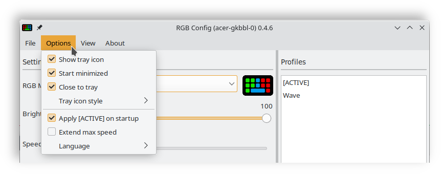
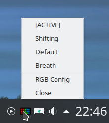

#  RGB-Config-Acer-gkbbl-0
A simple GUI for controlling the RGB settings of the acer-gkbbl-0 kernel module

Visit JafarAkhondali's [project page](https://github.com/JafarAkhondali/acer-predator-turbo-and-rgb-keyboard-linux-module) for information on the kernel module


# Features
 * Configure RGB settings of the acer-gkbbl-0 kernel module
 * Supports all available RGB modes (Static, Breath, Neon, Wave, Shifting and Zoom)
 * Settings can be saved as profiles
 * Tray icon for quick profile change (on supported systems)
 * Last used settings can be automatically restored uppon application start
 * Animated preview for selected RGB mode 

# Restrictions
 * acer-gkbbl-0 kernel module must be installed separately
 * Compatibility depends on the specific laptop model and its compatibility with the acer-gkbbl-0 kernel module
 * The **static** RGB mode does not work with my specific laptop and is thus untestet
 * The tray icon only works in desktop environments that are compatible with classic system tray

# Installation
Make sure you have the **acer-gkbbl-0** kernel module installed before you proceed with the installation of this application, otherwise it will have no effect. Visit JafarAkhondali's [project page](https://github.com/JafarAkhondali/acer-predator-turbo-and-rgb-keyboard-linux-module) for more information on the kernel module.

**RGB-Config-Acer-gkbbl-0** is written in Python3, using the wxPython framework. Python3 is usually provided by most Linux distributions, wxPython must often be installed separately.

## .deb package
For Debian based systems (Ubuntu, Mint, etc.) a **.deb** package is provided. Your system's package manager will manage all necessary dependencies.

Download the **RGB_Config_acer-gkbbl-0_\<VERSION>_deb.deb** file from the [releases page](https://github.com/x211321/RGB-Config-Acer-gkbbl-0/releases). Depending on your system you can install the .deb file by double clicking it in your file manager or alternatively install it via the command line.

```
sudo dpkg -i RGB_Config_acer-gkbbl-0_<VERSION>_deb.deb
```

After installation **RGB Config (acer-gkbbl-0)** should show up in your application launcher under both the **Settings** and **Utils** sections. 

Alternatively run the application from the command line:

```
rgb_config_acer_gkbbl_0
```

## Python script
Python 3 should already be provided by most Linux distributions.

Download the **RGB_Config_acer-gkbbl-0_\<VERSION>_script.zip** file from the [releases page](https://github.com/x211321/RGB-Config-Acer-gkbbl-0/releases) and extract it somewhere on your hard drive.

The required dependencies can be installed via your distributions package manager.

**Debian/Ubuntu/Mint**
```
sudo apt install python3-wxgtk4.0
```

**Arch Linux**
```
sudo pacman -S python-wxpython
```

After that you should be able to start the application by running:
```
./rgb_config_acer_gkbbl_0.py
```

Or alternatively:
```
python3 ./rgb_config_acer_gkbbl_0.py
```

# Options


## Show tray icon
Display a tray icon in the notification area where to **RGB-Config-Acer-gkbbl-0** can be hidden. The tray icon also provides quick access to saved profiles. 
 * Left click on the tray icon to hide or restore **RGB-Config-Acer-gkbbl-0**
 * Right click to show the tray menu
 * The tray icon only works in desktop environments that are compatible with classic system tray (e.g. it did **not** show on a fresh ubuntu install).



## Start minimized
Automatically hide application uppon start. Indended for setups where the application is run on bootup (e.g. placed in your desktops auto start).

## Close to tray
Hide the application to tray instead of closing it when the close button in the title bar is pressed. 

## Apply [ACTIVE] on startup
Auomatically apply the last used RGB settings when the application is started. See the "Profiles" section for more information regarding profiles.

## Extend max speed
Official Acer software only allows animation speeds between 0 and 9. The **acer-gkbbl-0** kernel module actually accepts values between 0 and 255, which depending on your specific system may or may not have an effect. Since speed values above 9 are not officially supported they are hidden by default. The "Extend max speed" option extends the speed range from 0-9 to 0-255. Results may vary.

# Profiles

## Save profiles
RGB settings can be saved as profiles. Simply configure your prefered settings and click on the **Save as profile** button. The application will ask for a profile name and store it in the profile directory.

## Load profiles
Saved profiles are listed in the profile list on the right side of the application. Click on a profile and press the **Load** button to restore the profile settings. Loaded profiles are **not** automatically applyed to the RGB device and must first be activated via the **Apply** button. 

 * Profiles that are selected via the tray icon are directly applied and must not be activated separately.

## Delete profiles
Select the profile you want to delete from the profile list and press the **Delete** button. The profile will be removed from the profile directory.

## The [ACTIVE] profile
The [ACTIVE] profile is automatically generated whenever settings are applied to the RGB device. The [ACTIVE] profile thus represents the last used settings and is automatically restored whenever the application is started.

## Compatibility with facer_rgb.py
The profiles that this application generates are compatible with the **facer_rgb** script that is provided by JafarAkhondali's **acer-predator-turbo-and-rgb-keyboard-linux-module**, with the exeption of static mode for which **RGB-Config-Acer-gkbbl-0** has implemented muliple colors per profile (one for each section of the keyboard). A static mode profile that was generated with **RGB-Config-Acer-gkbbl-0** would only apply the color of the first section when run with **facer_rgb**.

## Profile directory
In compatibility with facer_rgb, profiles are stored in:
```
~/.config/predator/saved profiles/
```

# Configuration file
RGB-Config-Acer-gkbbl-0 saves user preferences in:
```
~/.config/rgb_config_acer_gkbbl_0/preferences.json
```

# Dev instructions

## General structure
 * The UI was designed with **wxFormBuilder**
 * Open **ui.fbp** in **wxFormBuilder** to make changes to the UI
 * All application logic is handled in **rgb_config_acer_gkbbl_0.py**, mainly in the **AcerRGBGUI_Frame** class
 * The **lib/ui.py** file is automatically generated by **wxFormBuilder** and should **not** be edited manually
 
## The "scripts" folder
The "scripts" folder contains the **build_linux.py** script which generates the **.zip** and **.deb** files that are attached to the release page. 

Also included are the **rgb_config_acer_gkbbl_0** shell script (which is placed in **/usr/local/bin/** when installed via the **.deb** package) and the **rgb_config_acer_gkbbl_0.desktop** file (which gets installed under **/usr/share/applications/**).

The .deb packages installs the actual application files to **/usr/local/lib/rgb_config_acer_gkbbl_0/**.

## i18n
**RGB-Config-Acer-gkbbl-0** has support for multiple languages. Available languages can be found in the **assets/locale/** folder. 

To update the translation files run the **i18n_gen.py** script in the **scripts** folder.

To add a new language, extend the **languages** list at the top of the **i18n_gen.py** script with the two letter language code you want to add and run the script. A new translation template will be generated at:

```
assets/locale/<LANGUAGE>/LC_MESSAGES/rgb_config_acer_gkbbl_0.po
```

This translation template can be loaded with a compatible software like [Poedit](https://poedit.net/).

Once saved in Poedit, the new language will show up in the Options menu of **RGB-Config-Acer-gkbbl-0**. Poedit automatically generates the compiled **.mo** language file that is used by the program code.

## Dev dependencies

**Libraries**
 * wxPython
 * Python3
 * Python3-polib
 
**Tools**
 * wxFormBuilder
 * Poedit
 
**Debian/Ubuntu/Mint**
```
sudo apt install python3-wxgtk4.0 python3-polib
```


